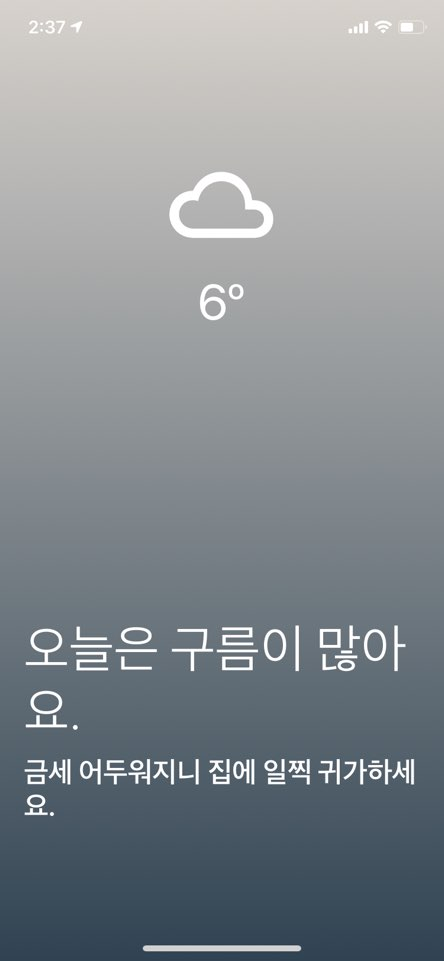

# TodayWeather App
Learning React Native by Building a Today Weather App ⛅️

## 프로젝트 설치 및 사용방법 
1. git clone https://github.com/DevRappers/today-weather
2. cd today-weather
3. npm install
4. yarn start

## ScreenShot

    
    
    

